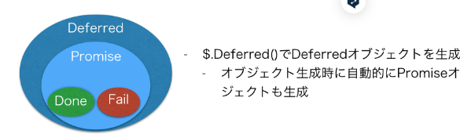

jQuery.Deferredが生成するオブジェクトで、DeferredはPromiseを内包しています。DeferredとPromiseは常に1対1で作成され、対応するDeferredだけがPromiseの内部状態を変更できる。

DeferredとPromise
2つともjQuery.Deferredが生成するオブジェクト
DeferredはPromiseを内包
Deferredオブジェクトを生成時に自動的にPromiseオブジェクトも生成される
DeferredとPromiseは常に1対1で作成される
Promiseオブジェクトは概念的には以下3つを持っている
状態
状態がresolvedになった時に実行されるコールバック(.done)
状態がrejectedになった時に実行されるコールバック(.fail)

現在はPromiseを利用することが推される。